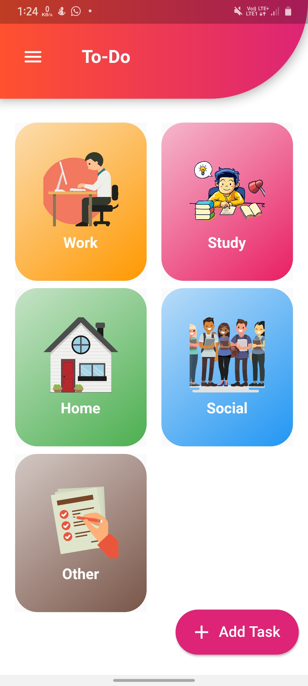
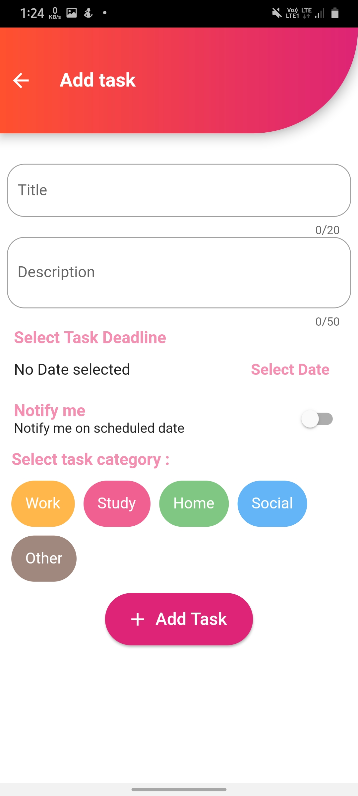
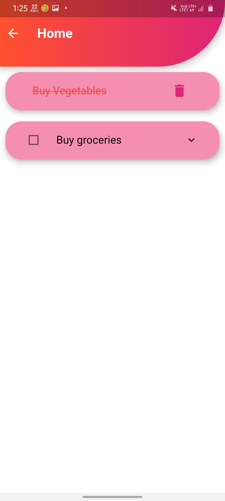
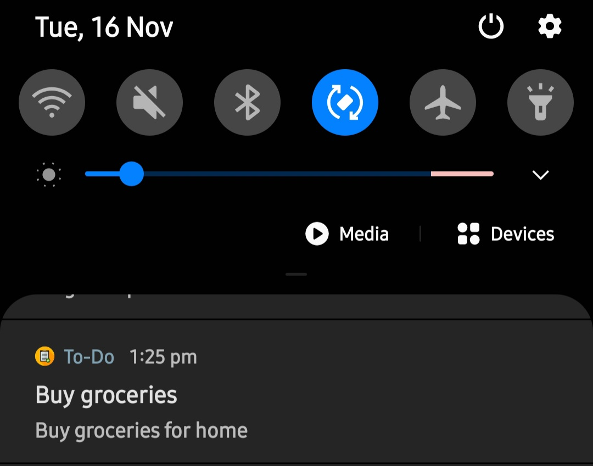

# To-Do app 

A To-do application made with Flutter that can help you keep track of your tasks
-> Used sqlite database (SQL database in flutter) to store the data locally in the app
-> Flutter Local Notification, that will notify you in the scheduled day.

Screenshots

## Getting Started
 

